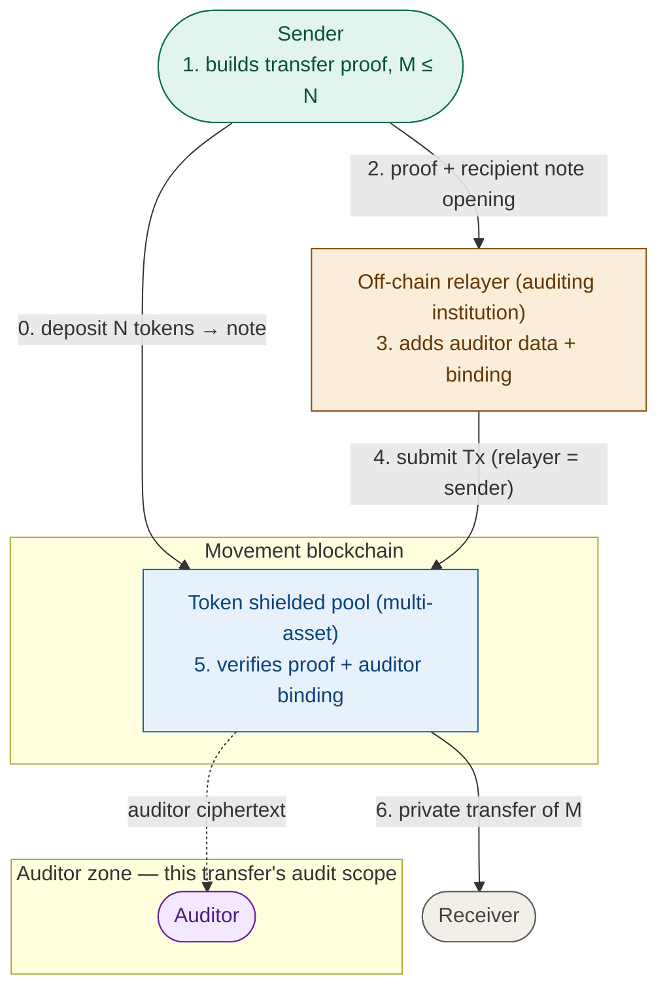
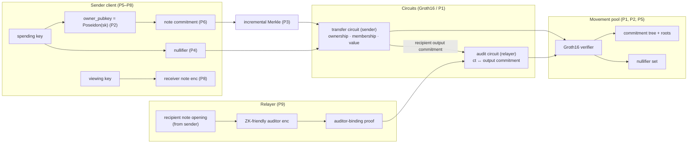

# MIP-X - Auditable Shielded Pools

**File naming convention:** When merged this file should be renamed to `mip-<NNN>-auditable-shielded-pools.md` with the number assigned by the MIP Manager. Diagrams, if any, belong under `mips/diagrams/mip-<NNN>/`.

## Summary

This MIP specifies **auditable shielded pools**, a design for private token transfers on Movement, together with the cryptographic primitive stack it requires. Value is held in **a single on-chain shielded pool** that supports any number of fungible assets — all sharing one commitment tree, so the anonymity set spans every asset. Every private transfer has an *audit scope*: one or more auditors, chosen per transfer by the sender, that can decrypt it. That per-transfer audit scope is a transfer's **auditor zone** — not a place funds live.

A user *deposits* tokens to shield them (creating a private UTXO-style *note*), *transfers* value privately to any receiver, and *withdraws* to unshield. Transfers are proved by the sender's own client and **verified on-chain**, so no off-chain ledger is required and only the sender can construct a spend.

Privacy is delivered through a **relayer**, run by the institution that guarantees the legality of the transfers. The sender generates a transfer proof, hands it to the relayer, and the relayer submits the transaction. Because the relayer is the on-chain transaction sender, the sender's Mainnet identity never appears; because the recipient and amount are hidden inside the proof, the public learns nothing about the transfer.

The relayer performs one additional, mandatory task: it attaches **auditor data** — an encryption of the transfer's `(receiver, amount)` to at least one auditor — and proves on-chain that the auditor's ciphertext faithfully encrypts the same values the transfer moves. The **sender chooses which auditor(s)** the transfer is audited under and selects a relayer that serves them; the relayer, operated by the auditing institution, is trusted to see the transaction in cleartext and is therefore the party that constructs the auditor data. To keep the relayer from substituting a different auditor, the sender **endorses its chosen auditor key(s) inside its own transfer proof**, and the chain requires every endorsed auditor to appear among the attached bindings.

The auditing institution can observe all transaction information for the transfers it relays; transfers relayed by another operator are not visible to it. Funds are not confined to a zone: a sender may pay any receiver, and an **auditor zone** here is only the **audit scope** (which auditors participate), chosen per transfer by the sender.

The primitive that establishes this assurance is the **auditor-binding proof**, which guarantees that a relayed transfer contains exactly the data it declares to the auditor (receiver and amount). Neither a dishonest sender nor a dishonest relayer can submit inconsistent data: the sender's transfer proof binds the true `(receiver, amount)` into the output note commitment, and the relayer's auditor-binding proof ties the auditor's ciphertext to that same commitment. A dishonest relayer also cannot drop or swap out the sender's chosen auditor: the sender's endorsement of that auditor key is carried in the transfer proof and checked on-chain.

The remainder of the stack is the standard shielded-pool construction: a **Groth16 (BN254) verifier**, a **Poseidon** hash aligned between circuits and chain, an on-chain **incremental Merkle commitment tree**, a **nullifier** set, an **address→field reduction**, a **note commitment**, a **dual-key** model, and **note encryption** to the receiver.

In scope: the primitive stack (P1–P9); the three operations (deposit, transfer, withdraw) and their public-input layouts; the sender→relayer→chain transfer protocol and the auditor-binding construction; the on-chain module surface and events; the KYC gate; client and relayer responsibilities; and composability with other contracts. Out-of-scope items are below.

### Out of scope

- **Off-chain operator ledgers / rollups.** This design executes and verifies transfers **on-chain**. A separate off-chain "zone ledger" model is explicitly not proposed here.
- **Legal accreditation of auditors.** Auditor selection is permissionless at the protocol layer: the sender chooses the auditor and the operator serving it is responsible for its legitimacy. How an auditor is vetted as a legal entity off-chain is a policy matter outside this MIP.
- **Relayer economics.** Incentives and gas-paymaster accounting are out of scope for v1; a relayer-set transfer fee is planned for v2 (see [Future Potential](#future-potential)). Only the cryptographic property that lets a relayer submit on a sender's behalf (proof + nullifier authorize, not the submitter's identity) is specified here.
- **Swaps and arbitrary in-pool computation.** The pool supports shielded transfers only.
- **Trusted-setup ceremony logistics.** A multi-party ceremony per circuit is required and justified; the coordinator, contributor set, and transcript format are not specified here.
- **A new hash or curve.** This MIP composes established primitives (Poseidon, Groth16/BN254, embedded-curve ElGamal/ECDH, X25519 + HKDF + AEAD). It introduces no novel cryptography.

## High-level Overview

The pool is a conventional on-chain shielded pool — commitment tree, nullifier set, ZK-verified deposit/transfer/withdraw — with a relayer layer for sender privacy and a mandatory auditor layer for compliance. Nothing about a transfer executes off-chain: the sender proves the transfer is well-formed, and Movement verifies that proof before it moves value.



Two properties define the design. First, **the sender proves their own transfer.** The transfer proof establishes ownership of the input notes, their membership in the commitment tree, correct nullifier derivation, well-formed output commitments, and value preservation — the guarantees required of a shielded pool — and it binds the recipient and amount into an output note commitment.

Because that proof is self-authorizing (proof + nullifiers, not the submitter's identity), any account may submit it. This allows a relayer to act as the on-chain sender, so that the sender's Mainnet identity does not appear.

Second, **auditing is mandatory and provably faithful.** A private transfer that cannot be audited does not satisfy the compliance requirements of the target institutions, and audit data that the sender or relayer can forge provides no assurance.

Every transfer therefore carries, for at least one auditor, a ciphertext of the transfer detail under the auditor's key, and the relayer proves on-chain that this ciphertext encrypts exactly the `(receiver, amount)` committed in the transfer. The relayer attaches this data because it is operated by the auditing institution itself and is trusted to observe the transaction in cleartext. Which auditor(s) apply is the **sender's** choice: the sender picks the auditor(s), transacts through a relayer that serves them, and endorses those auditor key(s) inside its transfer proof so the relayer cannot silently substitute another.

The auditor(s) attached to a transfer are that transfer's **auditor zone** — its audit scope, and the only sense in which a "zone" exists here: not an environment funds enter, but the set of auditors under which the transfer is auditable. This is what the diagram's `Auditor zone` box marks.

The sender discloses the recipient note opening to the relayer, which verifies it against the public output commitment before constructing the auditor material. The chain enforces that at least one valid auditor binding is present and that every auditor the sender endorsed is among the bindings, so the relayer cannot omit auditing or swap in a different auditor, and the sender cannot misrepresent the recipient or amount.

Because a zone is only this audit scope, it does not custody funds or constrain the recipient: it is not an environment funds live in. A sender may pay any receiver directly, and the pool's transfer and withdraw entrypoints are callable by other Move modules, so a shielded pool composes into larger applications rather than confining funds within an environment.

## Impact

**Audiences and required actions:**

- **Protocol / framework maintainers.** BN254 pairing and scalar-field arithmetic are provided by the framework's `aptos_std::bn254_algebra` (`G1`/`G2`/`Gt`/`Fr`) and `aptos_std::crypto_algebra` (`multi_pairing`, `pairing`, `scalar_mul`), so no new curve or pairing code is required; the network must have the framework's generic-algebra feature enabled. The new cryptographic Move code is therefore limited to a thin Groth16 verifier (~150 lines) over those pairings and a Poseidon module with circom-compatible constants — the primary audit surface.
- **Auditing institutions (relayer operators).** Operate the relayer — the operator and the relayer are one party. Receive a sender's transfer proof and recipient-note opening, verify the opening against the transfer's output commitment, encrypt the audit data to the auditor(s) the sender endorsed (and to any further auditor the institution is itself obligated to include), build the auditor-binding proof for each, and submit the transaction as the on-chain sender. The relayer observes full transaction detail (this is required for compliance) and must safeguard it.
- **Client / wallet developers.** Custody the dual-key material, track notes, build deposit/transfer/withdraw proofs client-side, encrypt output notes to receivers, disclose the recipient note opening to the relayer for a relayed transfer, and let the sender endorse its chosen auditor key(s) as a public input to the transfer proof. Byte layouts for every hashed/encrypted structure are the compatibility contract and must match relayer and chain exactly.
- **Auditors.** Hold the key under which per-transfer audit data is encrypted; decrypt on-chain auditor ciphertext to recover the true `(receiver, amount)`. Auditors are chosen per transfer by the sender and served by an operator responsible for their legitimacy; auditor selection is permissionless at the protocol layer.
- **KYC attesters.** Where KYC is enforced on-chain, publish attestations into the pool's attestation tree; where it is relayer-enforced, gate relay service on off-chain KYC.
- **Contract integrators.** Call the pool's transfer/withdraw entrypoints from other modules to embed shielded payments in larger applications.

**Dependencies.** No dependency on prior MIPs. This MIP is the base shielded-pool standard; the wallet-integration interface and KYC-attestation specifics build on the contracts fixed here, and any future auditor-governance policy layers on top without changing them.

## Alternative Solutions

The consequential choices are how the auditor data is bound, which encryption the auditor data uses, the proof system, and the hash.

### Who builds and binds the auditor data (the central choice)

| Approach | Who encrypts audit data + proves it correct | Who names the auditor(s)? | Relayer sees tx detail? | Verdict |
|---|---|---|---|---|
| **Relayer-encrypted, sender-endorsed (this MIP)** | The relayer — the auditing institution/operator. Sender discloses the recipient note opening; relayer verifies it against the public output commitment, encrypts to the auditor(s) the sender endorsed, and produces the on-chain auditor-binding proof | Sender chooses them and endorses their keys in its transfer proof; relayer may add further auditors it is obligated to include, but cannot drop or swap the sender's | Yes — required for compliance | ✅ **Chosen** |
| Fully sender-attached | Sender encrypts the audit data and folds the binding into its own transfer proof | Sender | No | ❌ **Rejected** — the accountable institution must be able to see the cleartext and produce the ZK-friendly ciphertext (and add any auditor it is itself obligated to), so encryption and binding belong with the relayer, not the sender |
| Relayer chooses freely (no sender endorsement) | Relayer encrypts + binds; auditor identity is entirely the relayer's | Relayer | Yes | ❌ **Rejected** — nothing stops the relayer binding to an auditor the sender never chose (a colluding or otherwise wrong one); the sender's endorsement closes this gap |
| No on-chain binding (trust the relayer) | Relayer attaches ciphertext with no correctness proof | Relayer | Yes | ❌ **Rejected** — a malicious relayer could attach garbage the auditor cannot use, defeating the compliance guarantee |

This split — the relayer encrypts and binds, the sender chooses and endorses — is forced by the operating model. The auditing institution runs the relayer and is trusted to see the transaction in cleartext, which is exactly what lets it produce the ZK-friendly auditor ciphertext; encryption and binding therefore belong with the relayer. But *which* auditor applies is the sender's decision: the sender picks the auditor appropriate to its transfer, transacts through the relayer that serves it, and pins that choice by endorsing the auditor key inside its own transfer proof. The sender's exposure is bounded to disclosing the one recipient note opening to that institution, which it would learn anyway. The chain enforces both properties — every binding is faithful to the recipient output commitment, and every sender-endorsed auditor is present among the bindings — which is what keeps the relayer honest about the audit content *and* about which auditor sees it.

### Auditor encryption

The auditor ciphertext must be **provably correct on-chain cheaply**, so it uses a **ZK-friendly** encryption: embedded-curve (Baby-Jubjub-style) ElGamal/ECDH to a per-transfer shared secret, with the audit plaintext masked by a Poseidon-derived keystream. Every operation is then Poseidon or embedded-curve arithmetic, so proving "this ciphertext encrypts the value opened from that commitment" is a small Circom circuit.

A conventional AEAD (AES/ChaCha) was rejected *for the auditor path* because proving AEAD correctness in-circuit is prohibitively expensive. The **receiver** note memo (P8), by contrast, keeps a conventional AEAD: its correctness is never proven on-chain (a malformed memo only prevents the receiver from detecting the note — a liveness, not a safety, issue), so it need not be ZK-friendly.

### Proof system

Groth16 over BN254 is chosen for on-chain verification cost: a verify is one `multi_pairing` over a handful of points (≈3 pairings plus a small MSM), well within per-transaction limits, with a ~150-line Move verifier.

UltraHonk/Plonk (universal setup, no per-circuit ceremony) generates a verifier of thousands of Move lines running thousands of metered native operations per verify — a compute risk and a large audit surface; STARKs avoid trusted setup but carry a larger, unproven-on-Move FRI verifier. Groth16's cost is a **per-circuit trusted setup**, addressed in [Risks and Drawbacks](#risks-and-drawbacks).

### Hash

Poseidon over BN254 with circom-compatible constants so the in-circuit and on-chain hashes agree by construction (the on-chain module is known-answer-tested against the circuit library's vectors). Poseidon2 and Rescue were considered and deferred pending an ecosystem-standard circuit library.

## Specification and Implementation Details

### Design principles

1. **The sender authorizes the spend; no one else can.** Only the holder of a note's spending key can produce a valid transfer proof. The relayer and the chain verify, they do not author.
2. **Auditing is mandatory and provably faithful.** Every private transfer carries ≥1 auditor binding, verified on-chain against the transfer's output commitment. Neither sender nor relayer can forge or omit it.
3. **The sender chooses its auditor, and the choice is enforced.** The sender endorses its chosen auditor key(s) in its own transfer proof; the chain requires each endorsed auditor to appear among the bindings, so the relayer cannot substitute or drop it.
4. **Circuit / chain hash agreement is by construction.** Identical Poseidon parameterization in-circuit and on-chain; known-answer-tested.
5. **Relaying is permissionless at the cryptographic layer.** Transfers authorize on proof + nullifier, never on submitter identity, so a relayer may act as sender without gaining the ability to alter the transfer or move funds.
6. **Byte layouts are the compatibility contract.** Field orderings, endianness, address reduction, and domain separators are pinned here and reproduced identically by client, relayer, and chain.

### Auditor zones

An **auditor zone** is the *audit scope* of a transfer: the auditor(s) under which that transfer is audited. It is not an object funds live in, and it is not registered per institution — it is simply which auditor(s) the sender chooses for a given transfer. A zone does not custody funds and does not constrain the recipient; it names *who audits*, not *where value may go*.

**A zone is per transfer, not a place funds live.** A note in the pool belongs to no zone. Each transfer independently names its auditors, so the same sender's transfers can be audited by different auditors, and a note can be spent under auditors unrelated to whatever transfer created it. There is nothing to "move between": a different audit scope is just different auditors on the next transfer.

**Auditor selection is permissionless.** The protocol maintains no approved-auditor list. Operators define which auditors they serve and are responsible — legally and operationally — for those auditors being legitimate; the sender chooses its auditor(s) from what operators offer and transacts through a relayer that serves them. The chain does not judge who is a valid auditor; it enforces only that every private transfer carries at least one *faithful* auditor binding (P9) and that every auditor the sender endorsed is among the bindings.

**The sender pins its choice.** So a relayer cannot quietly bind to a different auditor than the one the sender asked for, the sender endorses its chosen auditor key(s) as a public input to its transfer proof. The pool checks that each endorsed key appears among the attached bindings' `auditor_pubkey`s. The relayer may attach *additional* auditors it is itself obligated to include, but it cannot drop or substitute the sender's — the endorsement is authorized by the sender's spend and cannot be forged by the relayer.

**On-chain state.** There is no zone object, no `zone_id`, no per-institution registration, and no approved-auditor set. The auditor for a transfer appears only as the `auditor_pubkey` carried in that transfer's P9 binding, and the rule is asset-agnostic: it applies to a transfer of any supported asset.

**Binding a transfer to its audit scope.** For each transfer the relayer attaches, per auditor, a P9 ciphertext and binding proof — covering every auditor the sender endorsed plus any the operator adds. The pool requires at least one, verifies that each binding proof ties its ciphertext to the transfer's recipient output commitment, and checks that every sender-endorsed auditor is present. A transfer with zero valid bindings, or one missing a sender-endorsed auditor, is rejected.

### The primitive stack

The client note/key layer feeds two proofs — the sender's transfer proof and the relayer's auditor-binding proof — which the on-chain verifier checks together, linked by the shared recipient output commitment.



#### P1 — Succinct proof system (Groth16, BN254)

- **Where:** On-chain verifier + off-chain provers (sender for deposit/transfer/withdraw; relayer for the auditor binding).
- **Property:** Computational soundness (under Groth16's knowledge/AGM assumptions) and zero-knowledge (nothing leaks beyond the public inputs).
- **Parameterization:** BN254. Proof is `A (G1) ‖ B (G2) ‖ C (G1)`; verify `e(A,B) = e(α,β)·e(vk_x,γ)·e(C,δ)` with `vk_x = IC₀ + Σ publicᵢ·ICᵢ₊₁` via `crypto_algebra::multi_pairing` over `bn254_algebra`. Public inputs are BN254 scalar-field elements, 32-byte little-endian; arkworks-compatible uncompressed points. Each circuit (deposit, transfer, withdraw, audit) has its own verifying key. **Requires a per-circuit multi-party trusted setup.**

#### P2 — ZK-friendly hash (Poseidon, BN254)

- **Where:** In-circuit and on-chain.
- **Property:** Collision and preimage resistance over the BN254 scalar field with a low-degree arithmetization.
- **Parameterization:** BN254 Poseidon, α=5, circom-compatible constants. Widths: t=2 (`owner_pubkey`), t=3 (nullifiers, Merkle nodes), t=5 (note commitments, attestation leaves). The auditor keystream (P9) also derives from Poseidon. Known-answer-tested against the circuit library so digests match in-circuit and on-chain.

#### P3 — On-chain incremental Merkle commitment tree (LeanIMT-style)

- **Where:** On-chain (the note set) with a client-side mirror for proving.
- **Property:** Succinct membership: a note is in the pool iff a valid inclusion path to a known root exists; the root binds the whole set.
- **Parameterization:** Binary incremental tree of dynamic depth, nodes hashed with P2 (t=3). Depositing/transferring inserts output commitments and rotates the current root into a bounded (~100) history buffer so a proof built against a recently-current root still verifies. Same hashing rule in-circuit and on-chain.

#### P4 — Nullifier scheme

- **Where:** Derived in-circuit; the nullifier set lives on-chain.
- **Property:** *Uniqueness* (each note yields one nullifier → no double-spend) and *unlinkability* (a nullifier does not reveal which commitment it retires).
- **Parameterization:** `nullifier = Poseidon-t3(commitment, spending_key)`. On-chain per-key membership set; a spend whose nullifier already exists is rejected. Per-key slots keep inserts parallelizable under Block-STM.

#### P5 — Address → field reduction

- **Where:** In-circuit and on-chain, wherever a Movement address (token, recipient) binds into a proof.
- **Property:** Deterministic, collision-safe map from a 256-bit address into the BN254 scalar field, applied identically in-circuit and on-chain.
- **Parameterization:** Reduce the 256-bit address modulo the BN254 scalar-field order. 256-bit addresses can exceed the ~254-bit modulus, so raw injection is unsound; the reduction is encoded in the circuit and applied by the client before proving.

#### P6 — Note commitment

- **Where:** In-circuit and client; the commitment is the Merkle leaf (P3).
- **Property:** *Hiding* and *binding* over the note contents.
- **Parameterization:** Note `{token, amount, owner_pubkey, salt}`; `commitment = Poseidon-t5(token, amount, owner_pubkey, salt)`, `owner_pubkey = Poseidon-t2(spending_key)`, `amount` a range-checked u64, `token` the P5-reduced metadata address (the pool supports many assets; each note records its own `token`), `salt` fresh hiding randomness. The recipient output commitment is the anchor the auditor binding (P9) attaches to.

#### P7 — Dual-key model

- **Where:** Client.
- **Property:** Separation of *spend authority* (ZK-friendly, to prove ownership cheaply) from *view authority* (ECDH-capable, to receive encrypted notes and to disclose viewing rights without spend rights).
- **Parameterization:** A **spending key** (BN254 scalar; `owner_pubkey = Poseidon-t2(spending_key)`) and a **viewing key** (on the P8 curve), independently derivable.

#### P8 — Receiver note encryption (ECDH + HKDF + AEAD)

- **Where:** Client encrypt/decrypt; ciphertext travels in an event.
- **Property:** Confidentiality and integrity of the output note delivered to the receiver, decryptable only by the receiver's viewing key. **Correctness is not proven on-chain** — a malformed memo only prevents the receiver from detecting the note (liveness), so it need not be ZK-friendly.
- **Parameterization:** Ephemeral-static ECDH on the deployment's chosen curve (X25519 default; secp256k1 permitted) → HKDF → ChaCha20-Poly1305.

#### P9 — Auditor encryption + binding proof (the primitive this MIP adds)

- **Where:** Built by the relayer; the auditor ciphertext travels on-chain, and the binding proof is verified on-chain (P1 over the audit circuit).
- **Property:** *Faithfulness* — the auditor ciphertext encrypts exactly the recipient identity and amount committed in the transfer's recipient output note — and *mandatory presence* — at least one valid auditor binding accompanies every private transfer. Together these guarantee that a named auditor can always recover the true transaction detail: the amount and the recipient's **in-pool identity** (`owner_pubkey`, the note's owner). Mapping that in-pool identity to a real-world identity is the auditor's off-chain (KYC) concern, not something on chain. Neither a dishonest sender nor a dishonest relayer can defeat this.
- **Parameterization:**
  - **Encryption (ZK-friendly).** For auditor public key `A` on an embedded curve (base field = BN254 scalar field): sample ephemeral `k`, compute `R = k·G` and shared secret `S = k·A`; derive a Poseidon keystream from `S` and mask the audit plaintext `(owner_pubkey, amount, token_reduced)` — the recipient's in-pool identity, the amount, and the token. Ciphertext is `(R, masked_fields)`. Every step is Poseidon or embedded-curve arithmetic, so correctness is cheap to prove.
  - **Binding proof (relayer-generated, audit circuit).** Public inputs `[recipient_output_commitment, auditor_pubkey, auditor_ciphertext]`. Proves `∃ (token, amount, owner_pubkey, salt)` such that `recipient_output_commitment = Poseidon-t5(token, amount, owner_pubkey, salt)` (the note commitment of P6) **and** `auditor_ciphertext = ZKEnc(auditor_pubkey; owner_pubkey, amount, token)`. The `recipient_output_commitment` is the *same* public value the transfer proof (P-transfer) produced, which is what ties the two proofs to one transfer.
  - **Sender→relayer handoff (the "proof from the user").** The sender discloses the opening `(token, amount, owner_pubkey, salt)` of the recipient output note to the relayer. The relayer recomputes `Poseidon-t5(...)` and checks it equals the public `recipient_output_commitment` — a self-checking disclosure that convinces the relayer the declared recipient (its in-pool `owner_pubkey`) and amount are exactly what the transfer moves, before it spends effort building the on-chain binding.
  - **Sender endorsement (anti-substitution).** The sender chooses its auditor(s) and commits to them as a public input of the transfer proof: `auditor_endorsement = Poseidon(sorted auditor_pubkeys)`. Because only the note owner can produce a verifying transfer proof, the endorsement is authorized by the spend and cannot be forged or altered by the relayer. On submission the relayer reveals the endorsed `auditor_pubkey` list in the clear; the chain recomputes `Poseidon(...)`, checks it equals `auditor_endorsement`, and checks each endorsed key appears among the attached bindings. The endorsed keys are public data already carried by the bindings, so this leaks nothing beyond what is on-chain.
  - **On-chain enforcement.** The pool verifies P-transfer, then requires ≥1 auditor binding proof, each verified against the transfer's `recipient_output_commitment`, and requires every sender-endorsed `auditor_pubkey` to be present among the bindings. A transfer with zero valid bindings, or one that omits a sender-endorsed auditor, is rejected. No `auditor_pubkey` is checked against any approved-auditor list — selection stays permissionless; the only constraint is that the sender's choice is honored and each binding is faithful. The relayer may attach further auditors beyond those the sender endorsed.

**Why P9 is central.** In this design the sender proves the transfer and the *relayer* attaches the compliance data. This division of roles is where trust could be violated: a sender could declare one recipient or amount while moving another, a relayer could attach auditor data that the auditor cannot decrypt, or a relayer could bind to an auditor the sender never chose.

P9 prevents all three. The sender's transfer proof binds the true `(receiver, amount)` into `recipient_output_commitment` and endorses the chosen auditor key(s); the relayer's binding proof forces the auditor ciphertext to encrypt the opening of that *same* commitment; and the chain rejects any transfer lacking a valid binding or missing a sender-endorsed auditor. The auditor's view is therefore complete and correct by construction, and the sender is guaranteed its chosen auditor is the one that sees the transfer — the properties on which the compliance guarantee depends.

### Operations and public-input layouts

Public-input orderings are fixed here and reproduced identically by circuit, client/relayer, and verifier. `token`/`recipient` are P5-reduced.

- **deposit (shield):** `[commitment, token, amount, kyc_root?]`. Checks the token is a supported asset, `amount ≠ 0`, (optionally) the depositor's KYC attestation is included under `kyc_root`, then inserts `commitment` and pulls the fungible asset into custody. Depositor, token, amount are public (shielding is a public act).
- **transfer (private, 2-in-2-out):** `[nullifier_0, nullifier_1, commitment_out_0, commitment_out_1, commitment_root, auditor_endorsement]`. Proves ownership of both input notes, their membership under `commitment_root`, correct nullifiers (even for a zero-value second input), well-formed output commitments, value preservation, and token consistency, and binds `auditor_endorsement = Poseidon(sorted chosen auditor_pubkeys)` — the sender's choice of auditor(s). One output is the recipient's, one is change to the sender; the relayer's opening identifies which. Nullifiers are marked spent; output commitments inserted. Accompanied by ≥1 **audit** proof (below); the pool checks every endorsed auditor appears among them.
- **audit (per auditor, relayer-generated):** `[recipient_output_commitment, auditor_pubkey, auditor_ciphertext]` — the P9 binding, tied to the transfer's recipient output commitment.
- **withdraw (unshield):** `[nullifier, token, amount, recipient, commitment_root]`. Proves ownership of a note under a known root and correct nullifier; binds the public `(token, amount, recipient)`; nullifies and releases the fungible asset. Recipient and amount are public on withdraw, so no auditor encryption is needed — the auditor observes the exit in cleartext.

### The relayed transfer protocol

```mermaid
sequenceDiagram
    autonumber
    participant U as Sender (client)
    participant R as Relayer (auditing institution)
    participant P as Shielded pool (Movement)
    participant V as Groth16 verifier (P1)
    participant A as Auditor
    U->>U: build transfer proof (P-transfer)<br/>binds (receiver, amount) + endorses chosen auditor(s)
    U->>R: transfer proof + recipient note opening (token, amount, receiver, salt) + chosen auditor pubkeys
    R->>R: recompute Poseidon commitment, assert == public recipient_output_commitment
    R->>R: ZK-encrypt audit data (P9) to each endorsed auditor (+ any the operator must add), build binding proof(s)
    R->>P: submit Tx (relayer = on-chain sender): P-transfer + audit proof(s) + ciphertext(s) + endorsed pubkeys
    P->>V: verify P-transfer (root known, nullifiers unspent, value preserved)
    P->>V: verify ≥1 audit proof vs recipient_output_commitment; endorsed auditors all present
    V-->>P: ok
    P->>P: mark nullifiers spent, insert output commitments, emit receiver memo + auditor ciphertext(s)
    A-->>A: later, decrypt auditor ciphertext to recover true (receiver, amount)
    Note over U,V: sender's Mainnet identity never appears (relayer is sender).<br/>A tampered opening or forged auditor data fails verification
```

The relayer cannot alter the recipient or amount (both bound in P-transfer), cannot move funds (only a valid spend proof can), cannot omit auditing (the chain requires a binding), and cannot substitute the auditor (the chain requires every sender-endorsed auditor to be present). The sender cannot deceive the auditor (the binding is to the same commitment their transfer produced). The public learns nothing; the auditing institution learns the full transaction detail — the intended compliance model.

### On-chain module (normative)

A single pool supports every enabled asset. It holds:

| Field | Purpose |
|---|---|
| `supported_tokens` | admin allow-list of enabled fungible assets (`Table<address, bool>`) — each note records its own `token`, so all assets share one tree, nullifier set, and custody account |
| `custody` (resource account + signer cap) | holds pooled funds; released only by a verified withdraw |
| `commitment_tree` + `roots` | incremental Merkle tree (P3) and bounded history of valid roots |
| `nullifiers` | spent-nullifier set (P4) |
| `kyc_root` (optional) | current attestation-tree root, when KYC is enforced on-chain |

Auditor keys are not held on-chain and there is no approved-auditor set (see [Auditor zones](#auditor-zones)). On a `transfer`, the pool checks that each attached auditor binding is faithful to the recipient output commitment and that every auditor the sender endorsed (in the transfer proof's `auditor_endorsement`) is present among the bindings; the `auditor_pubkey`s themselves are chosen by the sender and judged against no on-chain list. A note records no auditor — the audit scope is a property of the transfer, not of the note or the pool.

**Operations (normative):** `initialize_pool(token, config)`; `deposit(depositor, commitment, amount, proof)`; `transfer(submitter, transfer_proof, audit_proofs[], ciphertexts[], auditor_pubkeys[], root)` — requires ≥1 valid audit binding and that every sender-endorsed auditor is present; `withdraw(submitter, nullifier, amount, recipient, root, proof)`. `transfer` and `withdraw` ignore the submitter's identity (proof + nullifier authorize), enabling relaying. `transfer`/`withdraw` are public entry functions callable by other modules (composability).

**Invariants.** Custody funds leave only through a verified `withdraw`. `transfer` aborts unless at least one `audit_proof` verifies against the transfer's recipient output commitment. `transfer` aborts unless `Poseidon(sorted auditor_pubkeys)` reproduces the proof's `auditor_endorsement` and every endorsed key is bound. Nullifier reuse aborts. Proofs against an unknown root abort.

**Events:**

```move
struct Deposit    { token, amount, depositor, commitment }
struct Transfer   { nullifier_0, nullifier_1, commitment_out_0, commitment_out_1,
                    receiver_memo, auditor_ciphertexts }
struct Withdraw   { nullifier, token, amount, recipient }
```

Clients scan `Deposit`/`Transfer` to find and decrypt their notes (P8); auditors scan `Transfer.auditor_ciphertexts` (P9). No new indexer primitive is required.

### KYC gate

KYC is a pool-level configuration: **on-chain** — the deposit circuit proves the depositor's attestation is included under the pool's `kyc_root` (an attestation Merkle tree built with P2/P3), gating *entry*; or **relayer-enforced** — the relaying institution performs KYC off-chain and refuses to relay for unverified users, using the transfer proof and the disclosed opening as the object of its compliance checks. Either way, KYC gates entry/relaying, never exit: a KYC change never freezes existing notes.

### Client and relayer responsibilities

- **Client (sender).** Custody dual keys (P7); track notes by scanning events and decrypting with the viewing key (P8); choose the transfer's auditor(s) and endorse their keys in the transfer proof (`auditor_endorsement`); build deposit/transfer/withdraw proofs (P1) reproducing every pinned layout; for a relayed transfer, disclose the recipient note opening and the chosen auditor pubkeys to the relayer.
- **Relayer.** Verify the disclosed opening against the transfer's recipient output commitment; ZK-encrypt audit data to each auditor the sender endorsed (and to any the operator is itself obligated to add) and build the auditor-binding proof(s) (P9); submit as the on-chain sender, revealing the endorsed pubkeys; safeguard the transaction detail it necessarily sees.
- **Auditor.** Decrypt on-chain auditor ciphertext with its key to recover `(receiver, amount, token)`.

### Composability

`transfer` and `withdraw` are permissionless in submitter identity and exposed as public entry functions, so another Move module can drive a shielded payment as part of a larger flow (e.g. a payroll or settlement contract that calls the pool). The auditor-binding requirement travels with the call: any path that effects a private transfer must carry a valid binding, so composition cannot bypass compliance.

## Reference Implementation

A reference implementation of the pool module, the circuits (deposit, transfer, withdraw, audit), the Poseidon and Groth16 Move modules, and an off-chain client + relayer has been built and exercised end-to-end; a public link will be added here for external review.

All four circuits produce Groth16 proofs that verify on-chain, and the full **deposit → relayer-submitted private transfer** with a mandatory auditor binding has been run end-to-end on Movement testnet against real verifying keys (`mock=false`) — the auditor-binding proof verifies on-chain and a tampered ciphertext is rejected.

The verifier module supports a **mock** (accept-all) mode for contract tests and a **real** Groth16 path per circuit, so the on-chain state machine can be exercised independently of the (demo) trusted setups.

**Production readiness.** A conforming implementation is *production-shaped, not production-ready*. The mock-verifier path and any single-contributor "demo" trusted setup exist only to exercise the state machine and are **disqualifying for mainnet**. Before a deployment holds real funds it must, at minimum:

1. Replace every demo setup with a **multi-party trusted-setup ceremony per circuit** — including the `audit` circuit — with independent contributors and a public transcript.
2. Complete **external audits** of the new cryptographic code — Poseidon, the Groth16 verifier, and especially the `audit` encryption/binding circuit — and of the pool module.
3. **Populate a real anonymity set.** A sparse pool is not private regardless of the cryptography; a near-empty or single-note pool provides no unlinkability.
4. Run a **production relayer** with real key custody and availability, not a demo client.
5. Ship **viewing-key rotation** with historical cutoffs — a compromised viewing key otherwise leaks a recipient's history permanently.

**Feature flag / enablement.** The only node-level dependency is the framework's generic-algebra (BN254) feature, which must be enabled on the network; given that, no additional node feature flag is required. Enablement is otherwise gated by publishing the Groth16 verifier and Poseidon modules, completing the per-circuit trusted setup and setting verifying keys, and standing up a relayer that serves at least one auditor senders can choose.

## Testing

- **Primitives (P1–P9).**
  - Poseidon (P2): known-answer vectors (t=2/3/5); any digest-byte regression fails CI.
  - Groth16 (P1): reference `ark-groth16` vectors; tampered public input rejected; a real circuit proof accepted on-chain and its tampered variant rejected.
  - Merkle (P3): root shapes 1..n; inclusion/exclusion; historical-root buffer (proof against a retained root verifies, against an evicted root does not).
  - Nullifier (P4): double-spend rejected; distinct notes → distinct nullifiers.
  - Address reduction (P5): in-circuit and on-chain agree above and below the modulus.
  - Note commitment / receiver encryption (P6, P8): hiding/binding vectors; encrypt→decrypt round-trip; wrong key fails.
  - **Auditor binding (P9):** the audit circuit accepts a ciphertext that encrypts the committed `(receiver, amount)` and rejects one that does not; a transfer with zero valid bindings is rejected on-chain; the auditor decrypts the on-chain ciphertext to the true values; a relayer that alters `(receiver, amount)` relative to the transfer's output commitment cannot produce a verifying binding; a transfer whose bindings omit a sender-endorsed auditor, or whose revealed `auditor_pubkeys` do not reproduce `auditor_endorsement`, is rejected on-chain.
- **On-chain state machine.** deposit / transfer / withdraw happy path; KYC-gated deposit (on-chain mode); nullifier double-spend rejected; unknown-root rejected; transfer without a valid auditor binding rejected; transfer whose bindings omit a sender-endorsed auditor rejected; relayer-as-sender submission (sender identity absent) — against the mock verifier, then re-run against real Groth16.
- **End-to-end.** deposit → relayed private transfer (with auditor binding) → receiver detects note → auditor decrypts → withdraw, on devnet, including the negative test that a relayer-tampered `(receiver, amount)` fails.

**When results are expected.** Primitive KAT/unit and mock-verifier tests gate CI per PR; real-Groth16 and end-to-end devnet rehearsals follow the per-circuit trusted setups.

**Load testing** is deferred: operations are user/relayer-initiated and bounded by proving, not anonymous request volume.

## Risks and Drawbacks

**Backward compatibility.** Additive; changes no existing on-chain behavior.

| Risk | Mitigation |
|---|---|
| **Per-circuit trusted setup (Groth16).** Toxic waste lets its holder forge proofs — including a transfer that steals notes. | Multi-party ceremony per circuit with independent contributors, public transcript, published witnesses. A single-contributor "demo" setup is disqualifying for mainnet. Circuit changes re-run the ceremony. |
| **Circuit / chain divergence (P2, P5).** Mismatched Poseidon constants or address reduction silently orphans commitments or breaks proofs. | Known-answer tests against the circuit library; address-reduction agreement tests; byte layouts pinned here. |
| **Relayer trust.** The relayer observes full transaction detail and controls liveness and censorship of relayed transfers. | This is the model's compliance mechanism: the auditing institution runs the relayer, and this is stated explicitly. The relayer **cannot** alter recipient or amount, move funds, or omit auditing — all enforced on-chain. A user may also submit directly (forgoing sender privacy) as a fallback, and multiple relayers may provide redundant liveness. |
| **Auditor can see everything named to it.** The named auditor recovers full `(receiver, amount)` for every transfer it audits. | Intended. Auditor scope is per-transfer and the sender chooses the auditor; broadening or narrowing audit scope is a policy choice, not a cryptographic gap. |
| **Relayer binds to the wrong auditor.** A relayer could bind to an auditor the sender never chose (colluding, or otherwise not the sender's), leaving the intended auditor blind. | The sender endorses its chosen auditor key(s) in the transfer proof (`auditor_endorsement`); the chain requires every endorsed auditor to be present among the bindings. The endorsement is authorized by the spend, so the relayer cannot forge or drop it. |
| **Weak anonymity set.** A sparse pool gives weak unlinkability regardless of cryptography. | Anonymity grows with participation; a near-empty pool is not private. The single multi-asset pool helps — all assets share one anonymity set — but a fresh deployment still needs a population before privacy claims hold. |
| **Auditor-binding omitted or under-specified (P9).** Without an enforced, faithful binding, a relayer could defeat auditing. | P9's binding is verified on-chain against the transfer's output commitment and ≥1 is required; this is why P9 is normative, not an implementation detail. |
| **Sender lies about the transfer.** A sender might try to move different value than declared. | Impossible: the transfer proof binds the true `(receiver, amount)` into the output commitment, and the auditor binding is to that same commitment. |

## Security Considerations

**Network / protocol impact.** New on-chain cryptographic code is the Groth16 verifier (P1) and Poseidon (P2) — the primary audit targets. Verification cost is bounded (a few pairings + a small MSM per proof, and one audit proof per auditor), so per-transaction compute is predictable.

**The trust split and P9.** The design's safety depends on two bindings:

- *Spend safety:* only a valid transfer proof moves a note, and it authorizes on proof + nullifier, so a relayer submitting on the sender's behalf can neither alter the recipient or amount nor move funds.
- *Audit faithfulness and auditor choice:* the auditor ciphertext is bound in-circuit to the same recipient output commitment the transfer produced, the chain requires ≥1 such binding, and it requires every auditor the sender endorsed in its transfer proof to be present — so neither a dishonest sender nor a dishonest relayer can defeat auditing or steer the transfer to an auditor the sender did not choose.

Weakening P9 (for example, attaching auditor data without the on-chain binding) invalidates the compliance guarantee and is therefore disallowed.

**Relayer confidentiality.** The relayer necessarily learns the transaction (it encrypts the audit data), so the operating institution sees the full detail of the transfers it relays. This is a deliberate trust placement, not a leak: the *public* still learns nothing. Operators must protect the plaintext they handle; a compromised relayer discloses the transfers it processed but still cannot move funds or forge audits.

**Nullifier soundness (P4).** Replay/double-spend protection depends on deterministic, collision-free nullifiers and on-chain duplicate rejection; fresh `salt` per note and spending-key binding prevent collisions and cross-note linkage.

**Receiver-encryption confidentiality (P8).** Confidentiality of the delivered note depends on the AEAD and viewing-key secrecy; a leaked viewing key discloses that receiver's incoming history but grants no spend authority (P7 separation). Viewing-key rotation with historical cutoffs is a known gap.

**Trusted setup (P1)** is the highest-severity cryptographic risk (see Risks); a single-contributor setup is disqualifying.

**Address reduction (P5).** Unreduced 256-bit injection is unsound (wraps the field); the reduction is encoded in-circuit and applied by the client identically.

**Cryptography references.** Groth16 (Groth, 2016) over BN254; Poseidon (Grassi et al.) with circom-compatible parameters; ElGamal/ECDH over an embedded (Baby-Jubjub-style) curve with a Poseidon keystream for the auditor path; HKDF (RFC 5869); ChaCha20-Poly1305 (RFC 8439); X25519 (RFC 7748).

## Future Potential

- **Relayer-set transfer fees.** A v2 fee mechanism in which the relayer sets and collects a per-transfer fee; incentive and paymaster accounting are defined there.
- **Variable-arity transfers.** The 2-in-2-out shape is the simplest; n-in-n-out circuits enable batching and consolidation.
- **Sender-side auditing option.** A mode where the sender, not the relayer, builds the auditor binding (for deployments that want the relayer blind to detail), at the cost of fixing the auditor set before proving.
- **Multiple / threshold auditors.** Requiring m-of-n auditor bindings, or threshold-decryptable audit data, for higher-assurance compliance.
- **Universal / updatable setup.** Migrating to Plonk/UltraHonk removes the per-circuit ceremony at the cost of a larger on-chain verifier; revisit as Move-side costs fall.
- **Viewing-key rotation** with historical cutoffs to close the permanent-history-leak gap.
- **Post-quantum channels.** The receiver channel (P8) can adopt a PQ KEM under a versioned envelope when one is ecosystem-ready.
- **In five years.** Movement hosts shielded pools for many assets, each with a populated anonymity set, with competing compliant relayers naming their own auditors, and shielded payments embedded in mainstream applications through the composable transfer entrypoint.

## Timeline

### Suggested implementation timeline

- **Phase 1 — Primitives (P1–P8) and pool state machine (6–8 weeks).** Audited Poseidon and Groth16 modules; incremental Merkle; nullifier set; address reduction; note commitment/receiver encryption in the client; the multi-asset pool with deposit/transfer/withdraw behind a mock verifier.
- **Phase 2 — Auditing (P9) and circuits (in parallel + 4–6 weeks).** deposit/transfer/withdraw circuits and the audit circuit in Circom; ZK-friendly auditor encryption; relayer that verifies openings, encrypts audit data, builds bindings, and submits; real Groth16 path wired through the verifier.
- **Phase 3 — Trusted setup and end-to-end (4–6 weeks).** Multi-party ceremony per circuit; verifying keys on-chain; devnet rehearsals of the full deposit → relayed transfer → withdraw cycle, including relayer-tamper and missing-auditor negative tests.
- **Phase 4 — Audit and hardening.** External audit of Poseidon, Groth16, the circuits (including the audit circuit), and the pool; client/relayer hardening.

### Suggested developer platform support timeline

- **SDK / client:** Phase 1 (key/note/encryption) and Phase 2 (proving); relayer library in Phase 2.
- **CLI:** deploy/init path that publishes modules and sets verifying keys, Phase 3.
- **Indexer:** `Deposit`/`Transfer`/`Withdraw` are standard events; no new indexer primitive required.

### Suggested deployment timeline

- **Devnet:** end-to-end against mock then real Groth16 within Phase 3.
- **Testnet:** after audits (Phase 4) and devnet rehearsal.
- **Mainnet:** after testnet conformance and a completed multi-party trusted-setup ceremony per circuit. The author will refresh this estimate after the gatekeeper design review.

## Open Questions

| # | Question | Notes |
|---|---|---|
| 1 | **Auditor plaintext contents.** | Beyond `(receiver, amount, token)`, should audit data include sender-identifying material (which the relayer knows but the transfer proof does not bind)? Binding sender identity would require the sender to commit to it in the transfer. Decide before the audit circuit is finalized. |
| 2 | **Embedded curve for P9 encryption.** | Which embedded curve (base field = BN254 scalar field) and the exact ElGamal/Poseidon-keystream layout for the auditor ciphertext. Pin as part of the compatibility contract. |
| 3 | **Receiver-encryption curve (P8).** | X25519 (default) vs secp256k1 (reuses wallet keys). Fixed per deployment; pinned so notes are decodable across clients. |
| 4 | **Transfer arity.** | Fixed 2-in-2-out for v1 vs variable arity. Affects the transfer circuit and change-note handling. |
| 5 | **KYC mode default.** | On-chain attestation vs relayer-enforced as the default, and whether both are offered. |
| 6 | **Framework vs package primitives.** | Whether Poseidon and the Groth16 verifier ship as Move-framework primitives or audited package modules. Affects audit surface and reuse. |
