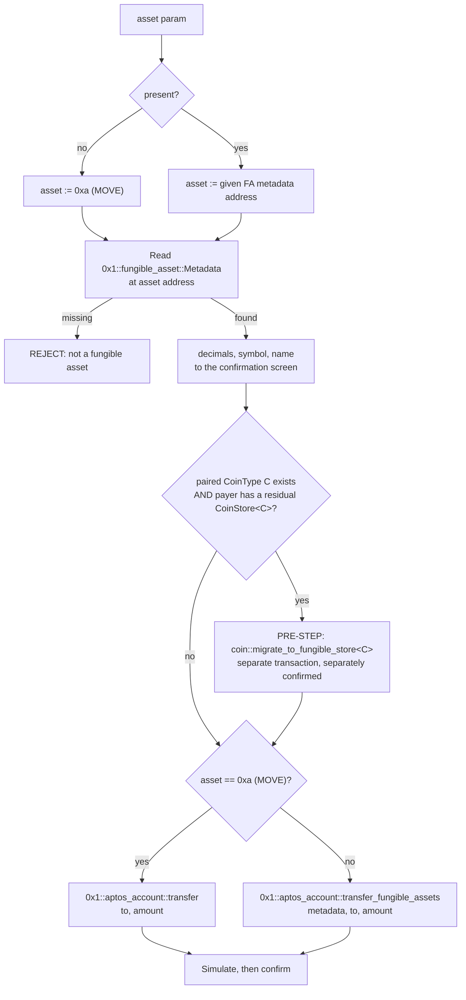
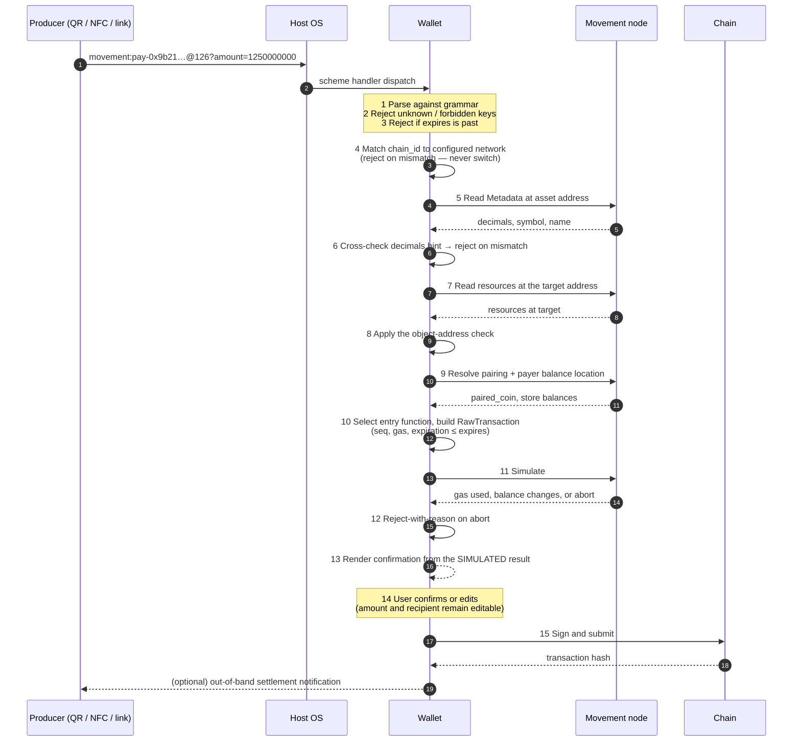

---
mip:
title: Transaction Request URLs (`movement:`)
author: ganymedio
Status: Draft
type: Standard (Interface)
created: 2026-07-28
---

# MIP-X - Transaction Request URLs (`movement:`)

## Summary

This MIP defines a `movement:` URL scheme that carries a payment request, together with the normative rules a conforming wallet applies before presenting the resulting transaction for confirmation. A request names a recipient address, an asset, and an amount; the wallet selects the entry function that satisfies it.

The format is deliverable over any channel that can carry a string — a QR code, an NFC tag or card, a hyperlink, a chat message — and every conforming wallet parses it identically.

## Motivation

There is no standard way to hand a Movement transaction request from one application to another. A merchant page, a printed invoice, a QR code, an NFC tag, or a chat message that wants to say "pay 12.5 MOVE to this address" must either deep-link into one specific wallet's bespoke format or ask the user to copy a 64-character hex address by hand.

The consequence is that payment acceptance cannot be built once. Every merchant integration, point-of-sale terminal, invoicing tool, and card or tag personalization flow has to be written against a particular wallet, and adding a second wallet means writing it again. Physical-world acceptance in particular — where the only channel is a printed code or a tap — has no portable representation at all.

## High-level Overview

A request is a URL: scheme, form prefix, target address, optional chain ID, query parameters.

```
movement:pay-0x9b21…c4f2@126?amount=1250000000&label=Coffee
```

The target is the recipient address. Every parameter is a suggestion the payer may change: the asset (`asset`, defaulting to MOVE), the quantity (`amount`, in the asset's atomic unit), a validity deadline (`expires`), and display strings (`label`, `message`).

The wallet, not the URL, selects the entry function that satisfies the request. A URL stamped on a physical card cannot be revised, and the framework's correct dispatch path changes over time — the coin-to-fungible-asset migration is in progress now — so a URL that named its own call would stop working. [Asset resolution and entry-function selection](#asset-resolution-and-entry-function-selection) specifies the selection rules.

A conforming wallet parses, validates, resolves the asset, selects the entry function, simulates, and then renders a confirmation screen. The screen, not the URL, is what the user authorizes. Simulation is required because a transfer can abort for reasons the request producer cannot observe: a dispatchable withdraw or deposit hook, a frozen store, or funds still held in an unmigrated legacy store. Two further checks are specified — a long-form-address requirement, since Move addresses carry no checksum, and an object-address check, since a deposit to an object address can be irreversible.

## Impact

**Audiences and required actions:**

- **Wallet implementers (Motion Wallet, third-party Movement wallets).** Register the `movement:` URL scheme with the host OS where the platform permits (Android `intent-filter`, iOS `CFBundleURLTypes`), implement the parser and the [normative processing pipeline](#wallet-processing-pipeline), and satisfy the [confirmation UI requirements](#confirmation-ui-requirements). Wallet classes that cannot register a scheme handler — browser extensions — consume requests through in-page link interception or paste; the entry point is transport, and conformance is the pipeline and the confirmation requirements.
- **Request producers (merchant integrations, invoicing tools, point-of-sale software, faucets, dApp "pay" buttons, NFC tag and card personalization tooling).** Emit requests conforming to [Syntax](#syntax), with all hex lowercase and addresses in long form. Include `@<chain_id>` on every request.
- **SDK maintainers (`@moveindustries/ts-sdk`).** Ship a `buildTransactionRequestUrl` / `parseTransactionRequestUrl` pair and the conformance vectors, so that wallets and producers share one implementation of the grammar rather than five. Details in [Reference Implementation](#reference-implementation).
- **Asset issuers.** No required action. Note that issuers who register dispatchable withdraw or deposit hooks are choosing to make their asset's transfers abortable for reasons a request producer cannot see; the wallet's simulation step is what keeps that from becoming a confusing failure at signing time.
- **Chain governance / node operators.** No action. Nothing here is on-chain.
- **End users.** A new capability, not a behavior change: tapping a link, scanning a QR code, or tapping an NFC tag opens the wallet with the recipient and amount pre-filled, still requiring explicit confirmation. Nothing about existing flows changes.

**If we do not accept this proposal:** every wallet keeps its own deep-link format, every merchant integration is written against one wallet, and physical-world payment acceptance — cards, tags, printed codes — stays blocked on a per-wallet integration for each. The concrete cost is that the ecosystem cannot build a payment acceptance rail at all without picking a wallet monopoly first.

**Dependencies on other MIPs:** none. This MIP follows MIP-001's precedent that fungible assets are addressed by their **FA metadata object address** and that legacy coin type strings are not part of an interface's input surface; see [Asset resolution and entry-function selection](#asset-resolution-and-entry-function-selection).

## Alternative Solutions

**Name the entry function and its arguments in the URL.** A request would carry `<target>/<function>` plus arguments keyed by type. Rejected: the target position cannot denote both a payee and a callable function in Move; a fungible asset has no `transfer` entry function for `/function` to name; and type-keyed parameters cannot express a positional, type-repeating, generic Move signature. Paying a fungible asset other than MOVE is inexpressible in that form.

**Encode a fully-built transaction payload (BCS) in the URL.** Put base64url-encoded BCS `EntryFunction` bytes in the URL and have the wallet sign them. Rejected on three grounds. (1) It is not human-inspectable. A payer must be able to read the recipient and amount out of the request; an opaque blob prevents that. (2) It pins the dispatch path at authoring time, so a URL stamped on a card breaks when the correct entry function changes — precisely the coin-to-FA situation the ecosystem is living through now. (3) It is longer than the intent form, which matters on a 144-byte NFC tag. A BCS payload form may still be worth defining later for genuinely complex calls, under a distinct form prefix; see [Future Potential](#future-potential).

**Reuse the wallet-standard `signAndSubmitTransaction` surface only, with no URL format.** Movement already has an in-page wallet interface. Rejected because it does not address the problem: the wallet standard requires a live JavaScript context with an already-connected wallet. A QR code on a receipt, an NFC tag in a card, and a link in a chat message have no such context. The two surfaces are complementary; a wallet may also accept a request URL handed to it in-page.

**Allow name-service names in the target position.** Rejected on three counts. There is no framework-level registry on Movement, so a wallet would have to hard-code a third-party resolver address to be interoperable — a centralization decision this MIP should not make by accident. An offline reader (an NFC tap in a poor-signal environment) cannot resolve a name at all, so a name-only request has no offline degradation path. And names invite homograph attacks, which would require a precedence rule and visual-similarity warnings this MIP would then have to specify. Reserving `name` and revisiting once a canonical registry exists costs nothing.

## Specification and Implementation Details

The key words MUST, MUST NOT, SHOULD, SHOULD NOT, and MAY in this document are to be interpreted as described in [RFC 2119](https://www.rfc-editor.org/rfc/rfc2119).

### Guiding principles

1. **The URL expresses intent; the wallet chooses the calldata.** A request names *what the payer should end up having done* (recipient, asset, amount), never *which function to call to do it* — except in the explicitly-scoped `call-` form. This is what lets a request outlive a framework change.
2. **The confirmation screen is the authority.** A request is a suggestion in full. Every field is user-editable or user-visible, and no parameter may cause a wallet to sign a transaction whose effects were not rendered. Any request the wallet cannot fully render, it rejects.
3. **Fail closed on anything unrecognized.** An unknown form prefix, an unknown parameter key outside the `x-` extension space, a forbidden key, a malformed value, or a chain ID that does not match the wallet's configured network is a hard rejection with a user-visible reason — never a silently-dropped field. A silently-dropped `amount` is a wrong-amount payment.
4. **Simulate before you render.** The wallet renders the *simulated* outcome, not the requested one. On Movement, whether a transfer can succeed depends on state the request producer cannot see.
5. **Human-inspectable on the wire.** A payer looking at the raw URL can read the recipient, the asset, and the amount. No compressed, encoded, or otherwise opaque encoding of those three fields.
6. **Degrade explicitly when offline.** A wallet with no RPC access can still honor a `pay-` request, with a labeled reduction in the checks it was able to perform. It MUST NOT silently skip a check it advertises.

### Syntax

Requests are URLs whose scheme is `movement`. The grammar is ABNF ([RFC 5234](https://www.rfc-editor.org/rfc/rfc5234)); `DIGIT` and `ALPHA` are as defined there.

```abnf
request         = scheme-prefix form [ "@" chain-id ] [ "?" parameters ]
scheme-prefix   = "movement" ":"

form            = "pay-" long-address       ; recipient; long form only

long-address    = "0x" 64HEXDIGL
special-address = "0x" HEXDIGL                  ; 0x0-0xf; `asset` only
HEXDIGL         = DIGIT / "a" / "b" / "c" / "d" / "e" / "f"

asset-value     = long-address / special-address
chain-id        = 1*3DIGIT                      ; 0-255; ChainId is a u8

parameters      = parameter *( "&" parameter )
parameter       = key "=" value
key             = "amount"  / "asset"  / "expires"
                / "label"   / "message" / "decimals" / ext-key
ext-key         = "x-" 1*( ALPHA / DIGIT / "-" / "_" )

amount-value    = uint / sci
uint            = 1*20DIGIT
sci             = mantissa ( "e" / "E" ) 1*2DIGIT
mantissa        = 1*DIGIT [ "." 1*DIGIT ]
```

**Lexical rules.**

- Hex is **lowercase**. A wallet MUST reject uppercase or mixed-case hex in an address rather than normalize it, because accepting mixed case invites the false inference that Movement addresses carry a checksum.
- Percent-encoding is [RFC 3986](https://www.rfc-editor.org/rfc/rfc3986). Inside any `string` value, and inside `label` and `message`, the characters `&` `=` `#` `%` `,` `[` `]` `(` `)` `+` MUST be percent-encoded. `+` MUST NOT be used to mean a space.
- A duplicated parameter key is a rejection, not last-wins or first-wins. Repeated keys carry no positional meaning, so a repeat can only be an error.
- Query parameter **order is not significant** and carries no meaning.

### Semantics

#### Form prefix

The prefix is **mandatory**. It costs 4 bytes and lets a later revision add a form whose target is not an address without any parsing ambiguity.

A future incompatible revision takes a new prefix separated by `-`. This MIP defines `pay-` and reserves `call-`, `sign-`, and `bcs-`. Any other prefix is rejected.

#### Target address (`pay-`)

Mandatory. The recipient of the payment. Must be `long-address`; a `special-address` in the `pay-` target position is rejected, since `0x0`–`0xf` are framework addresses and never payment recipients.

#### Chain ID

Producers MUST include a chain ID. A wallet receiving a request without one MUST treat it as targeting the currently-configured network and state that on the confirmation screen. Values are `0`–`255`; anything larger is malformed, since `ChainId` is a `u8`.

Known Movement values, verified against the public endpoints:

| Network | `chain_id` | REST endpoint |
|---|---|---|
| Movement mainnet | `126` | `https://mainnet.movementnetwork.xyz/v1` |
| Movement testnet (Bardock) | `250` | `https://testnet.movementnetwork.xyz/v1` |

A wallet MUST reject a request whose chain ID differs from its configured network, and MUST NOT silently switch networks to satisfy a request. The 8-bit chain ID space is shared with every other Move network, so the number alone is not a network identity — the `movement:` scheme carries at least as much of that meaning as the number does. Concretely: an `@1` request is Aptos mainnet's chain ID, and a Movement wallet MUST refuse it rather than reinterpret it.

#### `amount`

The quantity to transfer, in the **atomic unit** of the asset (octas for MOVE — 8 decimals, so `1250000000` is 12.5 MOVE).

- Must evaluate to an exact non-negative integer no greater than `18446744073709551615` (`u64::MAX`). A value that is out of range, or that has a fractional part after applying the exponent, is a **rejection**. Never saturate, wrap, or round.
- Scientific notation is permitted and is clearer on printed requests: `12.5e8` is exactly `1250000000`. The exponent SHOULD be the asset's decimal count, which is why the mantissa may carry a decimal point.
- Amounts are unsigned. A leading `+` or `-` is a rejection.
- If `amount` is absent, the wallet prompts the payer to enter one.

#### `asset`

The fungible asset to transfer, as its **FA metadata object address** (a `long-address`, or a `special-address` for framework-native assets — MOVE's metadata object is `0xa`).

If absent, the asset is MOVE. Legacy coin **type** strings (`0x1::aptos_coin::AptosCoin`) MUST NOT be used. A coin type requires `<`, `>`, and `::` escaping in a URL, does not exist for FA-native assets, and would push the coin-versus-FA dispatch decision onto the request producer. The metadata object address is the one identity every fungible asset has.

#### `expires`

Optional. A Unix timestamp in **seconds**. A wallet MUST reject a request whose `expires` is in the past, and MUST set the transaction's `expiration_timestamp_secs` to no later than `expires`.

Because `expiration_timestamp_secs` is a field of the signed `RawTransaction`, a URL-level expiry is **VM-enforced**: a request that has aged out cannot be executed late even if it was signed in time. For a point-of-sale or card-tap flow that is the difference between an expiry that is UI advice and one that is a guarantee.

#### `label` and `message`

Optional, percent-encoded UTF-8. `label` names the payee ("Coffee Shop"); `message` describes the payment ("Invoice 4471"). Both are **untrusted display strings** and are subject to [Untrusted display strings](#untrusted-display-strings). Neither reaches the chain: nothing in the framework's transfer entry functions carries a memo, and this MIP does not invent one.

#### `decimals`

Optional. A display-only hint for the asset's decimal count, present so that a wallet operating **offline** can render `1250000000` as `12.5` rather than as an unhelpful integer.

Normative handling: a wallet that can reach the chain MUST read the authoritative value from the asset's `0x1::fungible_asset::Metadata` and MUST reject the request if `decimals` disagrees with it — a mismatch is either a corrupted request or an attempt to make an amount read as 1000× smaller than it is. A wallet that cannot reach the chain MAY use the hint, and MUST label the rendered amount as unverified.

#### Forbidden parameter keys

These keys MUST cause a rejection with a user-visible reason. Silently ignoring them is worse than rejecting: a producer that used `value=` for the amount would have it dropped and the amount left unset.

| Forbidden key | Why |
|---|---|
| `value` | Not this format's amount key. Rejected so the mistake surfaces instead of an unspecified amount being paid |
| `gas`, `gasLimit`, `gasPrice` | Not this format's gas keys, and gas is not expressible in a request |
| `max_gas_amount`, `gas_unit_price` | The Move equivalents. A request producer has no basis for setting the payer's gas budget, and a URL-supplied `gas_unit_price` is a griefing vector: the payee sets a price the payer pays. Wallets set both from simulation |
| `sequence_number` | Wallet-owned. Movement sequence numbers are strictly consecutive per account; an externally supplied one can only be wrong |

Reserved-but-not-yet-defined keys — `sig`, `signer`, `fee_payer`, `name`, `nonce` — MUST also be rejected by a v1 wallet, so that a future MIP can define them without a v1 wallet having already assigned them a different meaning. Producers needing private parameters use the `x-` extension space; wallets ignore unrecognized `x-` keys, which MUST NOT affect the transaction.

### Asset resolution and entry-function selection

Entry-function selection is wallet-side. A request supplies at most an FA metadata address.

A fungible asset may have both a legacy `coin` type identity and an FA metadata object identity, paired through `coin::paired_metadata<CoinType>()` and `coin::paired_coin(metadata)`. `0x1::coin` is a facade over the FA store:

- `coin::withdraw<CoinType>` and `coin::deposit<CoinType>` operate on the **FA store**, not on `CoinStore`.
- `coin::balance<CoinType>` returns the legacy `CoinStore` balance **plus** the FA store balance, so reading a balance is unified while spending it is not.
- Migration out of a residual `CoinStore` happens only via `coin::migrate_to_fungible_store<CoinType>(&signer)` or `coin::migrate_coin_store_to_fungible_store<CoinType>(vector<address>)`. No withdraw path migrates implicitly.

Therefore:

1. **`aptos_account::transfer_coins<CoinType>` MUST NOT be used.** It withdraws from the FA store, so it fails when the payer's balance is in `CoinStore<C>`, and it adds the `EACCOUNT_DOES_NOT_ACCEPT_DIRECT_COIN_TRANSFERS` abort path.
2. **A residual legacy balance requires a migration transaction first.** If the payer holds a non-zero `CoinStore<C>`, the wallet MUST land `coin::migrate_to_fungible_store<C>` before the transfer. See [Open Questions](#open-questions) #4.

A residual legacy balance is detected by reading the `0x1::coin::CoinStore<CoinType>` resource at the payer's address, or as `coin::balance<CoinType>(payer)` − `primary_fungible_store::balance(payer, metadata)`. `coin_balance` is an `inline fun` and MUST NOT be relied on; it is not callable. The `CoinType` comes from `coin::paired_coin(metadata)`; `none` means the asset is FA-native and no legacy check applies.



`aptos_account` is used rather than `primary_fungible_store::transfer` because `transfer_fungible_assets` is non-generic, so the payment case needs no type arguments, and because `aptos_account`'s functions create the recipient's account when it does not exist. A payee may be an address that has never transacted.

The two entry functions differ in dispatch. `transfer_fungible_assets` routes through `primary_fungible_store::withdraw` → `dispatchable_fungible_asset::withdraw`, honoring dispatchable hooks and frozen stores. `aptos_account::transfer` calls `fungible_asset::unchecked_withdraw` / `unchecked_deposit`, bypassing the owner, frozen, and dispatchable checks, on the framework's reasoning that MOVE can be neither frozen nor dispatchable. Wallets MUST NOT route any asset other than MOVE through `aptos_account::transfer`.

Framework signatures, verified against Movement mainnet:

| Entry function | Type params | Parameters after `&signer` | Used |
|---|---|---|---|
| `0x1::aptos_account::transfer` | 0 | `address`, `u64` | MOVE only |
| `0x1::aptos_account::transfer_fungible_assets` | 0 | `Object<Metadata>`, `address`, `u64` | Every other FA |
| `0x1::coin::migrate_to_fungible_store<CoinType>` | 1 | *(none)* | Pre-step only |
| `0x1::aptos_account::transfer_coins<CoinType>` | 1 | `address`, `u64` | No |
| `0x1::primary_fungible_store::transfer<T: key>` | 1 | `Object<T>`, `address`, `u64` | No |

A wallet MUST expect and surface these abort paths, none of which a request producer can observe:

- A dispatchable withdraw or deposit hook aborting. Reachable on the `transfer_fungible_assets` path only.
- A frozen store on either side (`fungible_asset::set_frozen_flag`). Same reachability.
- Insufficient FA-store balance on a payer whose funds remain in a legacy `CoinStore`.

### Wallet processing pipeline

Normative, in order. Any step that fails aborts the whole request with a user-visible reason. The user is never shown a confirmation screen for a request that failed any step.



**Offline degradation.** A wallet with no node access MAY skip steps 5–12, and in that case MUST: label the amount as unverified when it used the `decimals` hint; state that the recipient could not be checked for the object hazard; and state that the transaction was not simulated and may abort. It MUST NOT proceed offline for any request naming a non-default `asset` — resolving the coin/FA pairing and the payer's balance location is not possible offline, so the entry function cannot be chosen correctly.

#### Insufficient MOVE for fees

Movement's gas schedule sets `txn.min_transaction_gas_units` to 2760000 against a `txn.gas_unit_scaling_factor` of 50000 — a floor of roughly 56 gas units on `max_gas_amount`.

Simulating with `estimate_max_gas_amount=true` for an account holding zero MOVE yields an estimated `max_gas_amount` of zero, below that floor, so the simulation fails the prologue with `MAX_GAS_UNITS_BELOW_MIN_TRANSACTION_GAS_UNITS` — a gas-configuration status that never reaches the entry function.

Wallets MUST NOT surface that status. Wallets MUST compare the payer's MOVE balance against the gas floor before simulating and render an "insufficient MOVE for network fees" state when it is below.

#### Object-address check

An object's address occupies the same 32-byte space as an account's and the two are indistinguishable as strings. `aptos_account::transfer` creates an account at any address that lacks one and deposits into its primary store, so a deposit to an object address succeeds. The resulting balance is unspendable: the auto-created `0x1::account::Account` has its `authentication_key` set to the address itself, and finding a key that hashes to a chosen address is computationally infeasible.

On Movement mainnet, `0xa` — the MOVE metadata object, and this MIP's default `asset` — hosts `0x1::object::ObjectCore`, an auto-created `Account` whose `authentication_key` is `0x0…0a`, and a `CoinStore<AptosCoin>` holding 999394914 octas. Those funds are not recoverable.

Before presenting a confirmation, a wallet MUST read the target's resources and:

1. **Hard-reject**, with no override, if the target hosts `0x1::fungible_asset::Metadata` or `0x1::fungible_asset::FungibleStore`. These are asset-infrastructure objects — an asset's own identity, and the stores where balances live — and are never valid recipients. A primary store object carries exactly `{FungibleStore, ObjectCore}` and no `Account`.
2. **Require an explicit typed acknowledgement**, not a dismissible dialog, if `0x1::object::ObjectCore` is present and tier 1 does not apply.

Tier 2 is not a hard rejection because a module holding an `ExtendRef` can produce an object's signer, making object-owned treasuries valid payees. An `ExtendRef` lives in arbitrary module state and is not discoverable, so a wallet cannot distinguish a recoverable treasury object from an unrecoverable store object. See [Open Questions](#open-questions) #6.

The check MUST test for the **presence of `ObjectCore`** and the tier-1 resources, never the *absence* of `0x1::account::Account`. Object addresses acquire an `Account` resource as a side effect of the mistake being guarded against.

Absence of all these resources MUST NOT be treated as an error. Paying a never-before-used address is the common case, and `aptos_account`'s transfer functions create the account.

### Confirmation UI requirements

The confirmation screen — not the URL — is what the payer authorizes. Conforming wallets:

1. Render the **recipient address in full**, 64 hex characters, never elided to `0x9b21…c4f2`. Move has no address checksum, so the middle of an address is where an undetectable substitution hides. Elision MAY be used in list views, never on a confirmation screen. The address SHOULD be rendered in fixed-size monospace groups for comparability; a wallet-local contact name or an address-derived visual fingerprint MAY be shown alongside the address, never instead of it.
2. Render the **amount in nominal units with the symbol**, from on-chain metadata (`12.5 MOVE`), alongside the atomic value. When decimals could not be verified on chain, label the figure as unverified.
3. Render the **asset's on-chain `symbol` and `name`**, and the metadata address for a non-default asset. Never render a producer-supplied asset name — there is no such parameter, by design.
4. Render `label` and `message` in a **visually distinct, clearly untrusted** region.
5. Render the **network**, by name, and never offer to switch it to satisfy a request.
6. Render the **simulated** balance changes and gas estimate. Render an abort as a failure, never as a confirmable transaction.
7. Keep **`amount` and recipient editable**. Every value in a request is a suggestion the payer may change.
8. **Never auto-submit.** Confirmation MUST NOT be bypassed by any configuration, allowlist, trusted-producer flag, or remembered-payee setting. A tap-to-pay flow may make confirmation *fast*; it may not make it *absent*.
9. Render nothing whose provenance is a URL parameter as though it were chain state.

#### Untrusted display strings

`label` and `message` are attacker-controlled. Wallets MUST: cap rendered length (256 UTF-8 bytes suggested) and truncate visibly; strip or escape bidirectional-override and zero-width code points, which are otherwise sufficient to make a rendered string read as a different address or amount; never interpret the strings as markup, HTML, or a link; and never let them occupy the region where the recipient, asset, amount, or network are rendered.

### Transport bindings

#### QR codes

Encode the URL as-is, in alphanumeric or byte mode. Capacity is not a constraint at these lengths.

#### Hyperlinks and chat

Encode as-is. Because a `movement:` link in a web page or message is at least as spoofable as the address it contains, requirement 1 in [Confirmation UI requirements](#confirmation-ui-requirements) is what protects the payer, not anything about the link.

On Android the intent filter MUST declare only the scheme (`<data android:scheme="movement" />`). The request URI is opaque — it has no authority component — and Android applies `android:host` / `android:path` matching only to hierarchical URIs, so a filter that adds either attribute never matches any request and fails silently.

Browser-extension wallets cannot register a scheme handler. A content script MAY intercept activation of `movement:` links and route the URL into the wallet's privileged process; this is a conforming entry point.

#### NFC / NDEF

A request is carried as a single NDEF **URI record** (TNF `0x01`, type `U`). Because `movement:` is not in the NFC Forum URI prefix abbreviation table, the identifier code is `0x00` (no abbreviation) and the whole URL is stored literally.

A device presenting a request dynamically (host-card emulation) MUST emulate an NFC Forum Type 4 tag carrying the same single URI record, so that a reader cannot distinguish a device from a passive tag and no application-specific APDU protocol is required.

Byte counts, driven by the 32-byte (64-character) address:

| Request | Length |
|---|---|
| `movement:pay-` + 64-hex address | 79 B |
| … + `@126` | 83 B |
| … + `?amount=1250000000` | 101 B |
| … + `&asset=0x<64 hex>` (non-MOVE asset) | 174 B |

The usable URI budget is a tag's maximum NDEF message size minus 5 bytes of single-record overhead:

| Tag | User memory | Max NDEF message | Usable URI bytes | MOVE request (101 B) | Non-MOVE FA request (174 B) |
|---|---|---|---|---|---|
| NTAG213 | 144 B | 137 B | 132 B | fits, 31 B spare | **does not fit** |
| NTAG215 | 504 B | 496 B | 491 B | fits | fits |
| NTAG216 | 888 B | 868 B | 863 B | fits | fits |

A request for any asset other than MOVE needs NTAG215 or larger. Producers targeting 144-byte tags SHOULD omit `label` and `message`.

An NDEF tag is rewritable unless its capability container is locked, and a passive tag can be replaced or overlaid, so a tag is no more trustworthy than any unauthenticated URL. A host-card-emulation reader can present a freshly generated record per tap, bounded by `expires`.

### Scheme registration

Custom URI schemes are unowned: on both mobile platforms any application may declare a handler for `movement:`, and the resolution when several do is platform-defined. This MIP therefore does not treat "the wallet opened" as evidence of anything, and the entire security model rests on the confirmation screen.

**Scheme availability.** `movement` does not appear in the IANA URI scheme registry. Movement SHOULD register it as a provisional scheme per [RFC 7595](https://www.rfc-editor.org/rfc/rfc7595); that does not prevent squatting, but it gives the scheme a citable definition.

Finally, wallets SHOULD NOT build a companion `https://` universal-link form as a substitute: it would place a hostname — and therefore an operator who observes every scan and tap — in the middle of a payment flow, which is a worse privacy and availability posture than an unowned scheme. See [Open Questions](#open-questions) #4.

## Reference Implementation

No on-chain code. Three deliverables, all off-chain:

- **`@moveindustries/ts-sdk` — parser, builder, and vectors.** `parseTransactionRequestUrl(url)` returning either a validated request or a typed rejection reason, and `buildTransactionRequestUrl(req)`. Shipping the grammar once keeps two wallets from disagreeing about whether `0xABC…` or `amount=+5` is acceptable.
- **Conformance vectors** — a JSON fixture set, versioned with this MIP, that any implementation in any language can run:
  - accept/reject pairs for every grammar rule, with the expected rejection reason on each;
  - `amount` boundary cases: `u64::MAX`, `u64::MAX + 1`, `1e19`, `1.5e0`, `12.5e8`, `+5`, `-5`, `0`, leading zeros;
  - the `0xa` object-address case as a fixture, since it is a live mainnet address and a natural regression test.
- **Wallet reference implementation** — `MoveIndustries/motion-wallet`: the OS scheme handler, the processing pipeline, and the confirmation screen. The NDEF binding is best exercised by a mobile build with NFC reader entitlements; an existing SwiftUI/Kotlin wallet testbed within the organization has already demonstrated NFC tap-to-send producing on-chain Movement transactions, and is the natural place to validate the [NFC / NDEF](#nfc--ndef) binding and its byte budget against physical tags.

**Feature flag / enablement.** No node-level flag; nothing here is consensus-visible. Enablement is: SDK release with the parser and vectors, then wallet releases registering the scheme, then producer adoption. A request sent to a wallet that has not shipped support simply does not open, which is a clean degradation.

## Testing

- **Parser conformance (SDK, CI-gated).** The vector suite run against the SDK parser. Every rejection asserts its specific reason, not merely that it failed.
- **Property tests (SDK).** `build → parse → build` is a fixed point. Any single-character mutation of a valid request either parses to a different request or fails the grammar; no mutation is silently ignored.
- **Amount arithmetic (SDK).** Boundary tests around `u64::MAX` and a fuzz pass asserting no input is accepted with a truncated, rounded, saturated, or wrapped value.
- **Asset resolution (wallet, local node and testnet).** MOVE by default and by explicit `asset=0xa`, asserting the `aptos_account::transfer` path; an FA-native asset and a paired asset with an FA-store balance, both asserting `transfer_fungible_assets`; a paired asset with a residual `CoinStore` balance, asserting a separately-confirmed `coin::migrate_to_fungible_store` pre-step; an asset whose dispatchable hook aborts, asserting the abort surfaces as a failure. Negative: `transfer_coins<C>` MUST NOT appear in any built payload, and `coin::balance` MUST NOT be treated as evidence of spendable funds.
- **Object-address handling (wallet).** `movement:pay-0x000…00a@126?amount=1` is hard-rejected against mainnet state via `Metadata`; a derived primary store address is hard-rejected via `FungibleStore`; a synthetic `ObjectCore`-only object hits the tier-2 gate; a never-used account address is accepted. Negative: an absence-of-`Account` implementation fails this suite.
- **Zero-gas-balance payer (wallet).** A payer holding no MOVE gets an insufficient-network-fee state and never sees `MAX_GAS_UNITS_BELOW_MIN_TRANSACTION_GAS_UNITS`.
- **Platform capability (one assertion).** `0x1::features::is_enabled(15)` returns `true` on the configured network. If it does not, every `Object<T>` entry argument breaks.
- **Chain-ID handling (wallet).** `@1`, `@250` on a mainnet wallet, `@256`, `@0126`, and an absent chain ID each produce the specified outcome; no case results in a network switch.
- **Expiry (wallet, against a node).** A past `expires` is rejected pre-signature. A near-future `expires` produces a transaction whose `expiration_timestamp_secs` does not exceed it, verified by decoding the signed transaction. Submission after expiry is rejected by the VM.
- **Display-string hardening (wallet).** Snapshot tests over `label` / `message` containing bidirectional overrides, zero-width characters, 10 KB of text, markup, and a nested `movement:` URL, asserting the recipient, asset, amount, and network regions render unchanged.
- **NDEF binding (wallet, physical).** Write the MOVE request to an NTAG213 and the FA request to an NTAG215 and tap both on iOS and Android, confirming the budget in [NFC / NDEF](#nfc--ndef) — including that the FA request on an NTAG213 fails at write time rather than truncating.
- **Cross-implementation.** Two independent wallet implementations run the same vector suite and agree on every accept and reject.

Parser and property tests gate every SDK change. Testnet asset-resolution and expiry matrices run before a wallet release. The physical NDEF pass and the cross-implementation run gate leaving Draft.

Load testing is not applicable: every request terminates at a human confirmation.

## Risks and Drawbacks

**Backward compatibility.** There is no incumbent standard. Existing wallet-specific deep links keep working under their own schemes, and wallets MAY support both. No on-chain behavior changes.

**Forward compatibility** is the principal risk, because a URL stamped on a physical card cannot be revised. An incompatible revision takes a new form prefix, so `pay-` semantics are never redefined; the fail-closed rule on unknown keys prevents a v1 wallet misreading a v2 request; and wallet-side dispatch absorbs framework changes in wallet releases rather than in reprinted cards.

| Risk | Mitigation |
|---|---|
| Address corruption in transit is undetectable — Move addresses carry no checksum, and short forms make many corruptions still-valid addresses | Long-form-only targets; full unelided address on the confirmation screen. Not fully mitigated — see Security Considerations |
| Funds sent to an object address and permanently lost | Tiered object check: hard rejection for asset-infrastructure objects, acknowledgement gate for other objects. The check tests for `ObjectCore` presence, not `Account` absence. `0xa` in long form serves as a regression fixture |
| A residual legacy `CoinStore` balance makes a payment fail while `coin::balance` reports funds | Wallet reads the `CoinStore<C>` resource, or subtracts the FA-store balance from `coin::balance`, then inserts a `coin::migrate_to_fungible_store` pre-step. Not solved by `transfer_coins`, which withdraws from the FA store and fails identically |
| Amount misparsed via scientific notation — a float-based parser silently rounds `18446744073709551615` | Exact-integer requirement, `u64::MAX` bound, rejection rather than saturation. Implementations MUST use exact decimal or big-integer arithmetic |
| Wrong asset paid — payer holds two assets with the same symbol | `asset` is an FA metadata object address, never a symbol or name. Symbol and name on the confirmation screen come from on-chain metadata only |
| `decimals` hint used to make an amount read 1000× smaller | Chain value is authoritative; a mismatch is a rejection, not a warning. Offline use of the hint is labeled unverified |
| Wrong-network payment — 8-bit chain IDs collide across Move networks | Chain ID MUST match the configured network; no network switching to satisfy a request; network rendered by name |
| Scheme squatting — any app can claim `movement:` | Assumed, not mitigated: the entire security model is the confirmation screen. Rejecting an `https://` universal-link substitute avoids trading this for a hostname dependency |
| Request replay — the same tag or QR paid twice | `expires` bounds the window and is VM-enforced. Genuine one-shot semantics need `nonce` (reserved) and an authenticated request; out of scope |
| Two wallets diverge on the grammar, and a request works in one and not the other | One parser in the SDK plus a versioned conformance suite; two independent implementations agreeing is the gate on leaving Draft |
| Dispatchable-hook or frozen-store aborts read to users as "the wallet is broken" | Mandatory simulation with the abort surfaced as a typed, explained failure before any confirmation screen |

**Drawbacks accepted.** A non-MOVE fungible-asset request does not fit a 144-byte NFC tag, a consequence of 32-byte addresses that no encoding choice short of an alias registry avoids. Requests are unauthenticated: nothing detects substitution of a whole request.

## Security Considerations

**Network and protocol impact: none.** No Move modules, no framework changes, no gas schedule changes, no consensus-visible behavior. Every transaction a conforming request produces is one the payer could construct by hand. The added attack surface is within wallet software: a hostile string arrives from outside and is parsed.

**Threat model.** A request is attacker-controlled — its origin is a link, a QR code, or a physical tag, none authenticated — and the scheme handler is unowned. The parser is an untrusted-input boundary. The properties preserved are: the payer can only sign what was rendered; no parameter reaches the chain unrendered; no request causes an irreversible action without confirmation.

These are enforced by fail-closed parsing (unknown, forbidden, reserved, duplicate, and malformed values are rejections), by keeping recipient, asset, and amount human-readable rather than encoded, by making confirmation unconditional, and by rendering the simulated outcome rather than the requested one.

**Irreversible loss to object addresses.** Specified in [Object-address check](#object-address-check). Two properties matter: the check tests for the presence of `ObjectCore` and the asset-infrastructure resources rather than the absence of `Account`, since object addresses acquire an `Account` as a side effect of the mistake; and asset-infrastructure objects are rejected rather than warned about.

**Address integrity.** Move has no address checksum. Long-form-only targets remove short-form ambiguity, and the full unelided address on the confirmation screen is the only defence against substitution. Corruption in transit is detected by the transport: QR codes carry Reed-Solomon error correction and NFC frames are CRC-protected.

**Amount parsing.** A double-precision float cannot represent `u64::MAX`, so an implementation evaluating `sci` in floating point will accept out-of-range amounts and produce wrong values near the top of the range. Exact decimal or big-integer arithmetic is required.

**Display-string injection.** `label` and `message` are the only free-text fields. Bidirectional-override and zero-width code points can make a rendered string read as a different address or amount; mitigations are in [Untrusted display strings](#untrusted-display-strings).

**Privacy.** A request discloses the payee address, and optionally an amount and label, to every party handling it. Because addresses are reused, a broadly published request links every payment made against it. Not addressed here.

**Not defended against.** Substitution of a request by an attacker controlling the delivery channel — a swapped NFC sticker, a replaced QR code, an altered link. The confirmation screen is the only defence, which is why its requirements are normative.

**Relevant specifications.** [RFC 3986](https://www.rfc-editor.org/rfc/rfc3986) (URI syntax), [RFC 5234](https://www.rfc-editor.org/rfc/rfc5234) (ABNF), [RFC 7595](https://www.rfc-editor.org/rfc/rfc7595) (scheme registration), and the NFC Forum NDEF and URI Record Type Definition specifications.

## Future Potential

- **Authenticated requests (`sig`, `signer`).** The largest gap. A request signed by the payee — or by a merchant key attested through `0x1::account_abstraction` or a keyless identity — would let a wallet display "verified payee" on a basis stronger than a recomputable hash, and would make swapped NFC stickers and replaced QR codes detectable rather than merely inadvisable. This is the follow-on with the best ratio of value to design surface, and the reserved keys exist so it can land without a v2 of the grammar.
- **Sponsored requests (`fee_payer`).** Movement supports fee-payer transactions natively. A merchant sponsoring gas would let a payer with a zero MOVE balance pay in a stablecoin — the single most common onboarding failure in a card or point-of-sale context. It needs a second signature collected out of band, so the URL can at most name the sponsor and an endpoint; that is a MIP of its own, and one worth writing.
- **Name resolution (`name`).** Once a Movement name registry exists, a name in the target position becomes worth defining — with a precedence rule and homograph warnings specified explicitly.
- **One-shot requests (`nonce`).** Genuine anti-replay for invoices, as opposed to the time-bounding that `expires` provides. Needs either an on-chain marker or a payee-side settlement callback, so it is not purely a format change.
- **Generic entry-function and BCS payload forms (`call-`, `bcs-`).** Reserved prefixes for non-payment requests, if a consumer emerges. Both would need an ABI cross-check and neither can work offline, which is why they are not specified here.
- **Confidential payment requests.** MIP-001 defines a `ca_*` wallet interface for confidential assets. A request form that resolves to `ca_transfer` rather than a public transfer is a natural composition and needs no protocol work — the two MIPs already agree that assets are addressed by FA metadata object address, which is what makes them composable at all.
- **In one year:** a shared parser in the SDK, two or more wallets passing the same conformance suite, and merchant integrations written once against the format rather than once per wallet. **In five years:** the format is the boring substrate under physical payment acceptance on Movement — cards, tags, terminals — and the interesting parts are authentication and sponsorship layered on top of a grammar that did not have to change.

## Timeline

### Suggested implementation timeline

- **Phase 1 — Grammar and vectors (2–3 weeks).** Parser and builder in `@moveindustries/ts-sdk`, with the conformance vector suite. The vectors are the interoperability contract; every later phase is tested against them.
- **Phase 2 — Wallet pipeline (3–4 weeks, after Phase 1).** Scheme registration, processing pipeline, object-address check, asset resolution, simulation, and the confirmation screen in the reference wallet.
- **Phase 3 — Transport bindings (1–2 weeks, overlapping Phase 2).** QR and link handling; NDEF read on iOS and Android with the byte budget validated against physical NTAG213 and NTAG215 tags.
- **Phase 4 — Cross-implementation conformance (2 weeks).** A second wallet runs the vector suite. Disagreements are resolved as MIP amendments while the MIP is still in Draft, which is the point of sequencing this before Last Call rather than after.
- **Phase 5 — Producer adoption (rolling).** Reference producer snippets for merchant and invoicing integrations; tag-personalization tooling emitting valid requests.

### Suggested developer platform support timeline

- **SDK (`@moveindustries/ts-sdk`):** Phase 1.
- **Wallet adapter (`@moveindustries/wallet-adapter-react`):** No changes required. Requests arrive through the OS scheme handler, not through the in-page adapter.
- **CLI:** A `movement-cli` subcommand that builds and validates request URLs, useful for producers and for generating fixtures. Low cost, worth doing in Phase 1.
- **Indexer:** No requirements. Requests are off-chain and leave no distinguishable on-chain trace, which is also why settlement notification is a producer concern rather than something this MIP can provide.

### Suggested deployment timeline

Nothing to deploy on chain — no devnet, testnet, or mainnet activation gate, and no release version to target. Adoption is a wallet and SDK release matter:

- **Devnet / testnet:** used throughout Phases 2–4 for asset-resolution, expiry, and abort-path matrices.
- **Mainnet:** requests against chain ID 126 work the moment a wallet ships support; the `0xa` object-address fixture is a mainnet-state test from Phase 2 onward.
- **Draft → Last Call:** gated on the Phase 4 cross-implementation result, not on a calendar date. The author will refresh this estimate after the gatekeeper design review, per the template's guidance.

## Open Questions

| # | Question | Options | Notes |
|---|---|---|---|
| 1 | **Should a wallet ever operate offline?** | (a) Allow degraded offline `pay-` for MOVE, as drafted. (b) Require connectivity for every request. | (b) is simpler and strictly safer — the object-address check and simulation are both unavailable offline. (a) exists because an NFC tap in a poor-signal environment is a real scenario and refusing outright pushes users to a worse workaround. If (a) stands, the labeling requirements need review as a set: an offline confirmation screen carries three separate "not verified" notices, which may be enough to be ignored. |
| 2 | **Companion `https://` universal-link form?** | (a) No, as drafted. (b) Yes, with a Movement-operated resolver. (c) Yes, producer-hosted. | Weighs unmediated custom-scheme handling against reliable app-store-quality link handling. (b)/(c) put an operator in every scan and tap — a privacy and availability regression — and (a) accepts that scheme squatting is possible. Wallet distribution experience should decide this. |
| 3 | **Legacy coin-type input for `asset`?** | (a) Reject, as drafted (MIP-001 precedent). (b) Accept and normalize to the FA metadata address for display. | (b) helps producers integrating against not-yet-migrated assets; it also puts `::`, `<`, `>` in URLs and gives producers a way to express a dispatch preference they should not have. Depends on how much unmigrated coin-only supply is expected to persist on Movement. |
| 4 | **How is a residual legacy `CoinStore` balance handled mid-payment?** | (a) Two confirmations: migrate, then transfer. (b) Migrate without asking, then confirm only the transfer. (c) Migrate opportunistically in the background, outside any payment flow. (d) Have the *payee* or another third party migrate the payer via the permissionless `coin::migrate_coin_store_to_fungible_store<C>(vector<address>)`. | Note what is **not** an option: using `transfer_coins<C>` to spend the legacy balance. It withdraws from the FA store and fails identically — see [Asset resolution](#asset-resolution-and-entry-function-selection). So some migration must happen. (a) is drafted, and is two approvals at exactly the point in a payment flow where users abandon. (b) violates the principle that only what was rendered gets signed. (c) is the best user experience and belongs in the wallet regardless of what this MIP says, but cannot be relied on by a request. (d) is genuinely available because that entry function takes no `&signer`, and is interesting for a merchant who would rather pay the gas than lose the sale — but it means a third party mutating the payer's account, which deserves its own scrutiny. Unresolved, and the highest-value question in this table for anyone building a point-of-sale flow. |
| 5 | **What should a wallet display when `expires` is absent?** | (a) Nothing. (b) An explicit "no expiry" notice. | Point-of-sale requests without an expiry are the ones most likely to be replayed from a photographed QR code. Cheap to display, and it nudges producers toward setting one. |
| 6 | **Should tier 2 of the object-address check be a hard rejection instead of a gate?** | (a) Unclickthroughable acknowledgement, as drafted. (b) Hard-reject every `ObjectCore` address. (c) Accept with an ordinary warning. | The asymmetry is stark: wrongly rejecting a legitimate object-owned treasury costs a failed payment, while wrongly accepting a store object costs the funds permanently. That argues for (b). Against it: object-owned treasuries with an `ExtendRef` custodian are legitimate payees, they are not distinguishable from unrecoverable objects by inspection, and (b) makes them unpayable by URL forever. (c) is rejected outright — a dismissible warning in front of irreversible loss is not a control. Whether (a) or (b) should also depend on how common object treasuries actually are on Movement, which is an empirical question worth answering before Last Call. |
| 7 | **Is a `symbol` display parameter worth adding for offline rendering?** | (a) No, as drafted — symbol comes only from chain metadata. (b) Yes, mirroring `decimals`, verified-when-online. | (b) makes offline rendering of a non-MOVE asset legible. It also creates a spoofable asset name in the URL, and unlike `decimals` a wrong symbol is not detectable by arithmetic. Drafted as (a) partly because the offline path already refuses non-default `asset` for dispatch reasons, which would make the parameter unreachable. |
